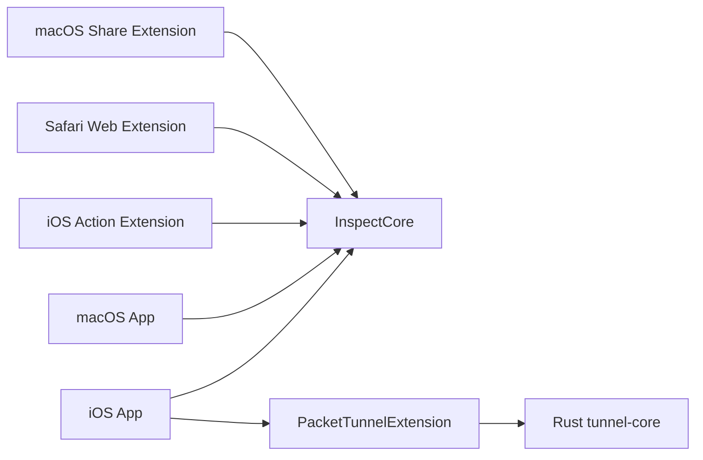

# Development

## Project Structure

Inspect is split into these layers:

1. `App/`: iOS app shell
2. `MacApp/`: macOS app shell
3. `Extension/`: iOS action/share extension
4. `SafariExtension/`: Safari web extension for iOS and macOS
5. `MacShareExtension/`: macOS share extension
6. `Packages/InspectCore/`: shared Swift models, feature UI, logging, and stores
7. `PacketTunnelExtension/`: iOS packet tunnel wrapper and Rust bridge
8. `Rust/tunnel-core/`: Rust forwarding core



## Runtime Flows

### Manual Inspect

1. The app, Safari extension, or share extension resolves a host or URL.
2. `TLSInspector` opens a direct TLS connection.
3. The result is normalized into `TLSInspectionReport`.
4. Shared feature UI renders summary cards and certificate detail.

### Safari Extension

1. Safari popup asks the native handler to inspect the active tab URL.
2. The extension returns a compact summary payload for the popup.
3. `Open Full Details` saves the report into the shared app group.
4. The app opens through `inspect://certificate-detail?...` and shows Swift certificate detail.

### macOS Share Extension

1. Safari or another host app shares a page or URL to `Inspect Certificate`.
2. The share extension extracts the URL.
3. The extension runs `TLSInspector`, stores the report in the app group, and opens `inspect://certificate-detail?...`.
4. The mac app opens directly into the certificate detail flow.

### Live Monitor

1. `LiveMonitorManager` starts the packet tunnel.
2. `InspectPacketTunnelExtension` configures the tunnel and launches the forwarding engine.
3. `tunnel-core` runs on top of `tun2proxy` and passively observes TLS traffic.
4. Observations are written back into the shared app group feed and log.
5. `InspectionMonitorStore` aggregates those observations into hosts and latest reports.

## Day-to-Day Commands

Common commands:

```bash
just generate
just rust test
just rust tun2proxy-harness
just test-ios-sim
just run-ios-device
just run-mac
just testflight-dry-run
just app-store-screenshots
```

Notes:

1. `project.yml` is the source of truth. Regenerate the Xcode project with `xcodegen generate`.
2. Prefer `xcodebuild ... | xcbeautify` for local and CI output.
3. The packet tunnel extension links the Rust static library directly; `InspectCore` does not link Rust.
4. Shared logs are written through the app group and surfaced in-app under Settings diagnostics.

## Requirements

- Xcode 16 or newer
- iOS 18 SDK
- XcodeGen
- `xcbeautify`

## Network Scope

Today:

1. TCP/TLS live monitoring works on device.
2. Passive SNI and certificate-chain capture work for the current TCP path.
3. UDP forwarding exists in `tun2proxy`, but Inspect does not yet surface UDP observations.
4. QUIC/HTTP3 certificate capture is not implemented.

## TestFlight Uploads

The main release entry point is:

```bash
just testflight
```

One-time setup:

```bash
cp Configs/LocalOverrides.xcconfig.example Configs/LocalOverrides.xcconfig
cp .env.example .env
```

Required `.env` values:

- `ASC_APP_ID`
- `APP_STORE_CONNECT_KEY_ID`
- `APP_STORE_CONNECT_ISSUER_ID`
- `APP_STORE_CONNECT_KEY_PATH`

If the current App Store Connect app already has the repo's `CURRENT_PROJECT_VERSION`, set `TESTFLIGHT_BUILD_NUMBER` before uploading.

Useful variants:

```bash
just testflight-build
just testflight-dry-run
```

Notes:

1. `just testflight` regenerates `Inspect.xcodeproj` with XcodeGen before archiving.
2. The archive/export flow uses automatic signing and `-allowProvisioningUpdates` by default.
3. `just testflight-build` stops after producing the exported artifact in `build/testflight/`.

## App Store Screenshots

Capture screenshots locally:

```bash
just app-store-screenshots
```

That uses the built-in `INSPECT_SCREENSHOT_SCENARIO` launch mode and writes output under `build/app-store-screenshots/output/`.

To upload screenshots:

```bash
./scripts/app_store_screenshots.sh upload <VERSION_LOCALIZATION_ID>
```

Or capture and upload in one pass:

```bash
./scripts/app_store_screenshots.sh capture-upload <VERSION_LOCALIZATION_ID>
```
