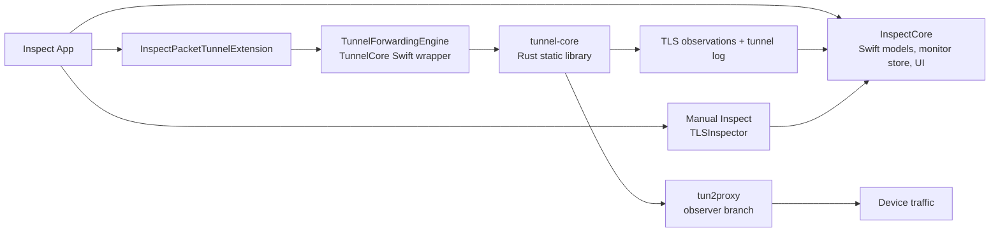

# Inspect

Inspect is an iOS certificate inspection app with two modes:

1. Manual inspection of a host or HTTPS URL
2. Passive live monitoring of hosts and certificate chains through an iOS packet tunnel

## Architecture

Inspect is split into four layers:

1. App UI in `App/`
2. Shared Swift package in `Packages/InspectCore/`
3. Packet tunnel extension in `PacketTunnelExtension/`
4. Rust forwarding core in `Rust/tunnel-core/`



## Runtime Flow

### Manual Inspect

1. The app resolves a host or URL.
2. `TLSInspector` opens a direct TLS connection.
3. The result is normalized into `TLSInspectionReport`.
4. The same report powers summary cards and certificate detail.

### Live Monitor

1. `LiveMonitorManager` starts the packet tunnel.
2. `InspectPacketTunnelExtension` configures the tunnel and launches the forwarding engine.
3. `tunnel-core` runs on top of `tun2proxy` and passively observes TLS traffic.
4. Observations are written back into the shared App Group feed and log.
5. `InspectionMonitorStore` aggregates those observations into hosts and latest reports.

## Repository Layout

- `App/`: app entry, tab shell, Settings, launch assets
- `PacketTunnelExtension/`: iOS packet tunnel wrapper and Rust bridge
- `Packages/InspectCore/`: shared Swift logic, UI, models, monitor state
- `Rust/tunnel-core/`: Rust forwarding core, replay harness, host-side tests
- `scripts/`: build and release helpers
- `justfile`: common local workflows
- `project.yml`: source of truth for the Xcode project

## Development

Common commands:

```bash
just generate
just rust-core-test
just rust-core-tun2proxy-harness
just test-ios-sim
just run-ios-device
```

Notes:

1. `project.yml` is the source of truth. Regenerate the Xcode project with `xcodegen generate`.
2. The packet tunnel extension links the Rust static library directly; `InspectCore` does not link Rust.
3. Shared tunnel logs are written through the App Group and surfaced in-app under Settings.

## Current Network Scope

Today:

1. TCP/TLS live monitoring works on device.
2. Passive SNI and certificate-chain capture work for the current TCP path.
3. UDP forwarding exists in `tun2proxy`, but Inspect does not yet surface UDP observations.
4. QUIC/HTTP3 certificate capture is not implemented.

## License

Inspect is licensed under GPLv3. See [LICENSE](/Users/hewig/workspace/h/Inspect/LICENSE).
