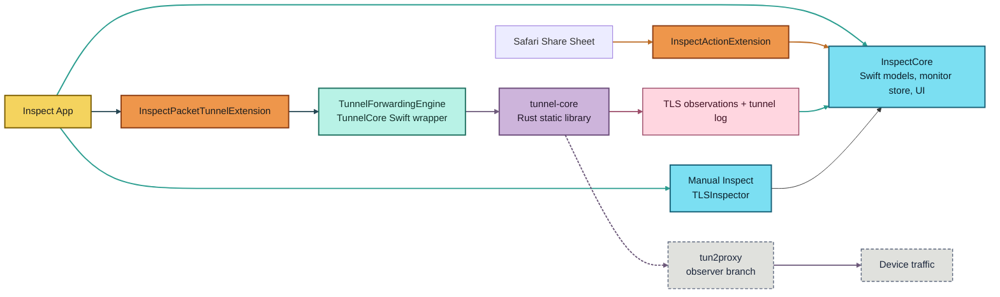

# Inspect

Inspect is a certificate inspector for iPhone and iPad with two modes:

1. Manual inspection of a host or HTTPS URL
2. Passive live monitoring of hosts and certificate chains through an iOS packet tunnel

This repository is the modern rewrite of the app, built with Swift 6, SwiftUI, Swift Package Manager, XcodeGen, and a Rust forwarding core for the packet tunnel path.

## Highlights

- Inspect a host name or HTTPS URL directly in the app.
- Open Inspect from the share sheet in Safari.
- Capture the presented trust chain from a live TLS handshake.
- Decode X.509 certificate fields including SANs, EKUs, key usage, AIA, SKI/AKI, policies, fingerprints, and public key details.
- Surface security findings for trust failures, hostname mismatch, expired certificates, weak crypto, suspicious CA usage, and common interception products.
- Export DER certificates from the chain.
- Passively monitor on-device TLS traffic through the packet tunnel extension.

## Architecture

Inspect is split into five layers:

1. App UI in `App/`
2. Share/action extension in `Extension/`
3. Shared Swift package in `Packages/InspectCore/`
4. Packet tunnel extension in `PacketTunnelExtension/`
5. Rust forwarding core in `Rust/tunnel-core/`



## Runtime Flow

### Manual Inspect

1. The app or share extension resolves a host or URL.
2. `TLSInspector` opens a direct TLS connection.
3. The result is normalized into `TLSInspectionReport`.
4. The same report powers summary cards and certificate detail.

### Live Monitor

1. `LiveMonitorManager` starts the packet tunnel.
2. `InspectPacketTunnelExtension` configures the tunnel and launches the forwarding engine.
3. `tunnel-core` runs on top of `tun2proxy` and passively observes TLS traffic.
4. Observations are written back into the shared App Group feed and log.
5. `InspectionMonitorStore` aggregates those observations into hosts and latest reports.

## Repository Layout

- `App/`: app entry, tab shell, Settings, launch assets
- `Extension/`: share/action extension entry point
- `PacketTunnelExtension/`: iOS packet tunnel wrapper and Rust bridge
- `Packages/InspectCore/`: shared Swift logic, UI, models, monitor state, and tests
- `Rust/tunnel-core/`: Rust forwarding core, replay harness, host-side tests
- `scripts/`: build and release helpers
- `justfile`: common local workflows
- `project.yml`: source of truth for the Xcode project

## Requirements

- Xcode 16 or newer
- iOS 18 SDK
- XcodeGen
- xcbeautify

## Getting Started

Generate the Xcode project:

```bash
just generate
```

`Inspect.xcodeproj` is generated from `project.yml` and is not intended to be committed.

Open the project:

```bash
open Inspect.xcodeproj
```

## Development

Common commands:

```bash
just generate
just rust test
just rust tun2proxy-harness
just test-ios-sim
just run-ios-device
just testflight-dry-run
just app-store-screenshots
```

Notes:

1. `project.yml` is the source of truth. Regenerate the Xcode project with `xcodegen generate`.
2. Prefer `xcodebuild ... | xcbeautify` for local and CI output.
3. The packet tunnel extension links the Rust static library directly; `InspectCore` does not link Rust.
4. Shared tunnel logs are written through the App Group and surfaced in-app under Settings.

## Current Network Scope

Today:

1. TCP/TLS live monitoring works on device.
2. Passive SNI and certificate-chain capture work for the current TCP path.
3. UDP forwarding exists in `tun2proxy`, but Inspect does not yet surface UDP observations.
4. QUIC/HTTP3 certificate capture is not implemented.

## TestFlight Uploads

This repo includes a `just testflight` flow that archives the app, exports an IPA, and uploads it through `scripts/testflight.sh`.

One-time setup:

```bash
cp Configs/LocalOverrides.xcconfig.example Configs/LocalOverrides.xcconfig
cp .env.example .env
```

Then update `.env`. `ASC_APP_ID`, `APP_STORE_CONNECT_KEY_ID`, `APP_STORE_CONNECT_ISSUER_ID`, and `APP_STORE_CONNECT_KEY_PATH` are required. If the current App Store Connect app already has the repo's `CURRENT_PROJECT_VERSION`, set `TESTFLIGHT_BUILD_NUMBER` before uploading. If you also set `TESTFLIGHT_GROUP`, the processed build will be distributed to that group after upload.

Run the full flow:

```bash
just testflight
```

Useful variants:

```bash
just testflight-build
just testflight-dry-run
```

Notes:

1. `just testflight` regenerates `Inspect.xcodeproj` with XcodeGen before archiving.
2. The archive/export flow uses automatic signing and `-allowProvisioningUpdates` by default. Set `TESTFLIGHT_ALLOW_PROVISIONING_UPDATES=false` in `.env` if you do not want that behavior.
3. `just testflight-build` stops after producing an IPA in `build/testflight/export/`.

## App Store Screenshots

This repo includes [`scripts/app_store_screenshots.sh`](scripts/app_store_screenshots.sh) to capture current App Store screenshots from Simulator using the built-in `INSPECT_SCREENSHOT_SCENARIO` launch mode.

Capture fresh screenshots locally:

```bash
just app-store-screenshots
```

That writes iPhone and iPad assets under `build/app-store-screenshots/output/`.

To upload them to an App Store version localization:

```bash
./scripts/app_store_screenshots.sh upload <VERSION_LOCALIZATION_ID>
```

Or capture and upload in one pass:

```bash
./scripts/app_store_screenshots.sh capture-upload <VERSION_LOCALIZATION_ID>
```

## Status

Inspect is actively maintained in its rewritten SwiftUI/SPM form. Older screenshots, implementation notes, or legacy code references may predate the current packet-tunnel architecture.

## License

Inspect is licensed under GPLv3. See [LICENSE](LICENSE).
