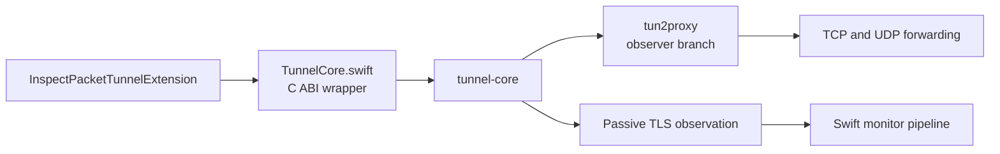

# tunnel-core

`tunnel-core` is the Rust forwarding and passive-observation layer used by Inspect's iOS packet tunnel extension.

## Role

`tunnel-core` is responsible for:

1. Starting the live forwarding worker from the Swift packet tunnel extension
2. Running the forwarding path on top of `tun2proxy`
3. Observing TLS traffic passively
4. Emitting observations and stats back to Swift
5. Writing shared tunnel logs for in-app diagnostics

The Swift side owns:

1. `NEPacketTunnelProvider`
2. tunnel configuration and lifecycle
3. App Group log/feed integration
4. monitor aggregation and UI

## Live Architecture



## Current Status

Working today:

1. stable C ABI for the packet tunnel extension
2. Swift wrapper through `TunnelCore.swift`
3. `tun2proxy`-backed forwarding engine
4. direct upstream DNS configured by Swift for the iOS tunnel
5. passive TLS ClientHello SNI extraction
6. passive TLS certificate-chain extraction
7. observation drain back into the Swift monitor pipeline
8. replay fixtures and host-side integration tests
9. critical-only logging by default with optional verbose mode

Not finished:

1. UDP observation surfaced back into Inspect
2. richer per-flow error metadata returned to Swift
3. QUIC/HTTP3 certificate capture
4. macOS product integration on top of the same runtime

## Local Development

```bash
cargo test --manifest-path Rust/tunnel-core/Cargo.toml
cargo build --manifest-path Rust/tunnel-core/Cargo.toml
cargo run --manifest-path Rust/tunnel-core/Cargo.toml --bin tunnel-core-replay -- fixtures/replay/sample_sni.json --pretty
cargo run --manifest-path Rust/tunnel-core/Cargo.toml --bin tunnel-core-replay -- fixtures/replay/sample_fragmented_handshake.json --pretty
cargo run --manifest-path Rust/tunnel-core/Cargo.toml --bin tunnel-core-replay -- fixtures/replay/sample_cert_chain.json --pretty
```

## Fixtures and Harnesses

Replay fixtures live in `fixtures/replay/`.

Supported replay packet kinds:

1. `tlsClientHello`
2. `tlsClientHelloFragments`
3. `tlsServerCertificate`
4. `tlsServerCertificateFragments`
5. `rawFile`
6. `pcapFile`

The host-side harness also validates the `tun2proxy` path with a real forwarded TCP session and verifies that TLS observations are emitted.
